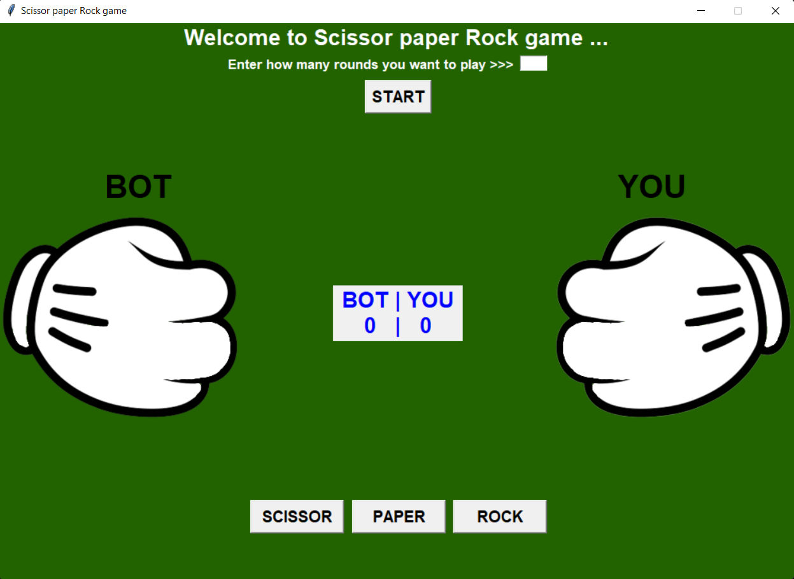

# Scissor-Paper-Rock Game
This game is createde using `Python` language along with `TKinter` library
## How to play this game
1. Fork this Repository
2. Clone this repository into your computer
3. Open the Repository in VS Code
4. Run the main.py file
## Gaming Graphics sample

